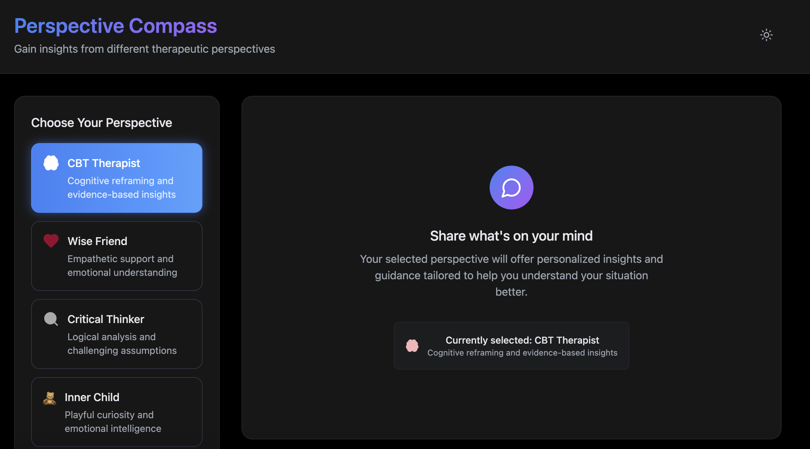

# Perspective Compass

**AI-powered therapeutic conversations with specialized personas for mental health support.**



## What it does

Users share thoughts/emotions → AI responds through 6 specialized therapeutic personas → Persistent conversation history → Multi-perspective mental health insights.

```
User Input: "I'm overwhelmed at work..."

├─ CBT Therapist: Cognitive reframing techniques
├─ Wise Friend: Emotional validation and support  
├─ Critical Thinker: Logical problem breakdown
├─ Inner Child: Emotional honesty and curiosity
├─ Stoic Philosopher: Acceptance and resilience
└─ Practical Advisor: Actionable solutions
```

## Tech Stack

- **Frontend**: React 19 + Vite + Tailwind CSS
- **AI**: OpenAI GPT-4o-mini with custom persona prompting
- **State**: LocalStorage for conversation persistence
- **Styling**: Dark/light themes, responsive design

## Quick Start

```bash
npm install
npm run dev
```

Add your OpenAI API key to `.env`:
```
VITE_OPENAI_API_KEY=your_key_here
```

## Architecture

- `src/services/openai.js` - AI persona system with conversation context
- `src/App.jsx` - Main UI with persona selection and chat interface  
- `src/components/ChatMessage.jsx` - Message rendering
- `src/utils/storage.js` - Conversation persistence

## Features

- 6 specialized therapeutic AI personas with distinct conversation styles
- Auto-expanding textarea with Enter-to-send (Shift+Enter for new lines)
- Conversation persistence across sessions
- Dark/light theme toggle
- Mobile-responsive design
- Custom avatar system for personas

## Use Cases

- **Personal reflection**: Multi-perspective analysis of life situations
- **Mental health support**: Therapeutic conversations with AI guidance
- **Decision making**: Different viewpoints on complex choices
- **Emotional processing**: Safe space for exploring feelings

## Important Notice

This application is designed for educational and self-reflection purposes only. It does not replace professional mental health care, therapy, or medical advice. If you are experiencing a mental health crisis or need professional support, please consult a qualified mental health professional or contact your local emergency services.